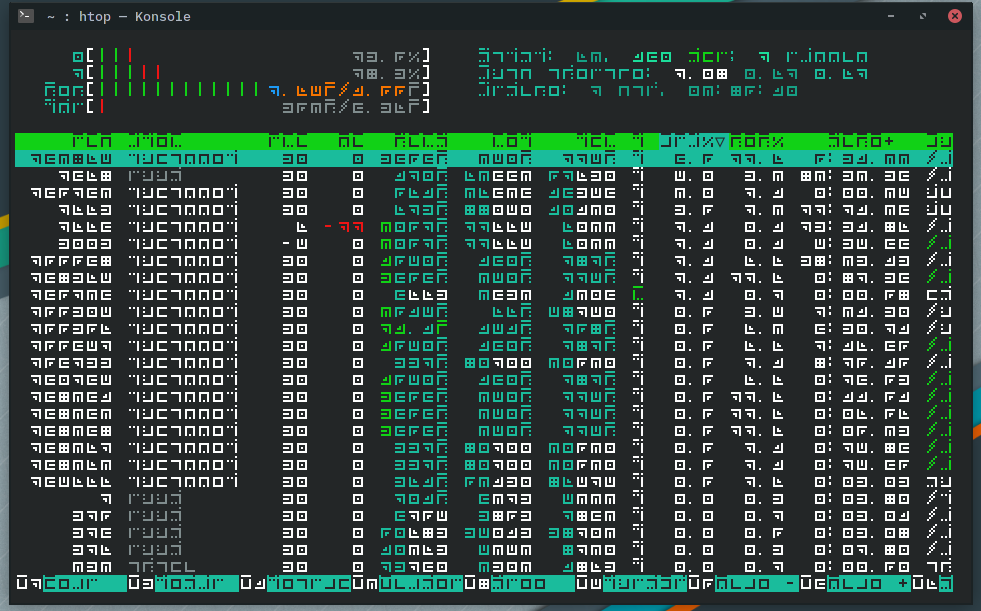
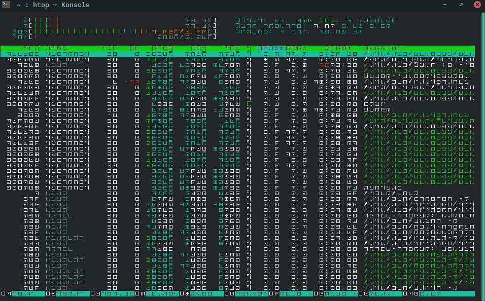

# Electric Elian
An Elian font designed for the digital age.

This font brings the beauty and unique look of [Elian Script](https://www.ccelian.com/concepca.html) to your home microcomputer. Inspiration for this font comes from [this Dwarf Fortress tileset](http://www.bay12forums.com/smf/index.php?topic=169671.0) by Koumakan. The original design for the characters comes from [this reddit post](https://www.reddit.com/r/unixporn/comments/2jqhit/2bwm_riced_the_alphabet/), but the original author has since been banned and the download links have been dead for years. So I have decided to resurrect the font from scratch as best I can.

I have next to no font-design experience, but [FontForge](https://fontforge.org/en-US/) has made it rather easy after I figured out how to use it. Still, the included fonts still have lots of extended characters missing, but the English alphabet A-Z, a-z, is included, along with numbers and commonly used glyphs like "@", "%", and "&", so it should at least be usable for common tasks until I add more glyphs.

Included in the repo are 2 fonts I plan on supporting:
* Electric Elian - The standard size bitmapped font.
* Electric Elian Micro - A small 1-pixel outline version of Electric Elian, for those who enjoy tiny fonts.

Example images of each are provided below running htop.

***
EXAMPLES:

Electric Elian

Electric Elian Micro

***

